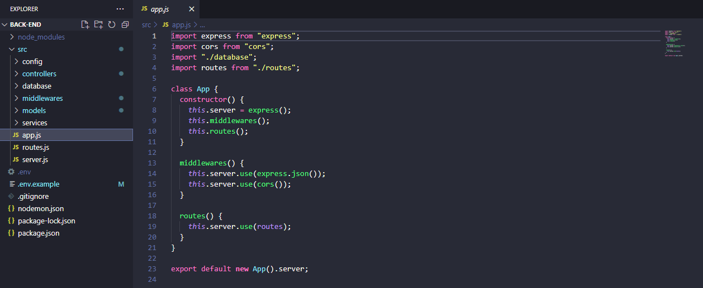
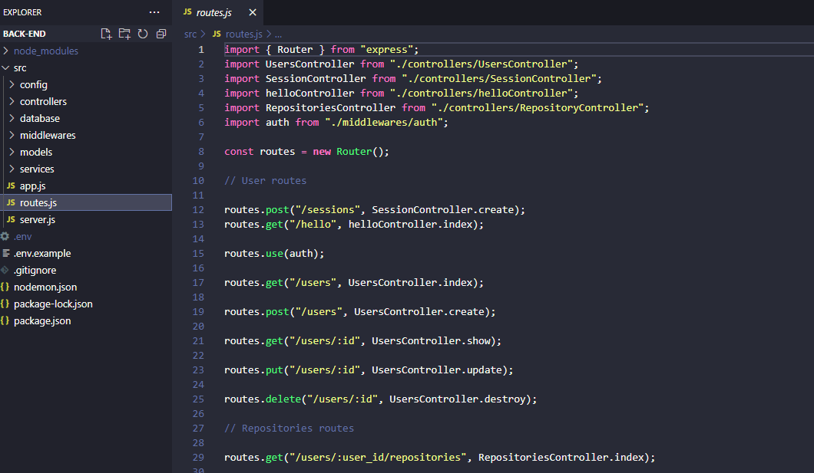
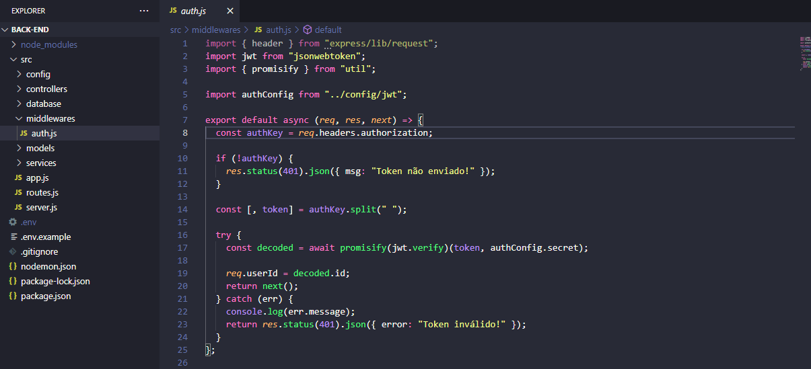
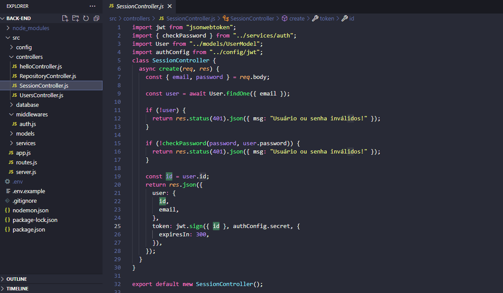
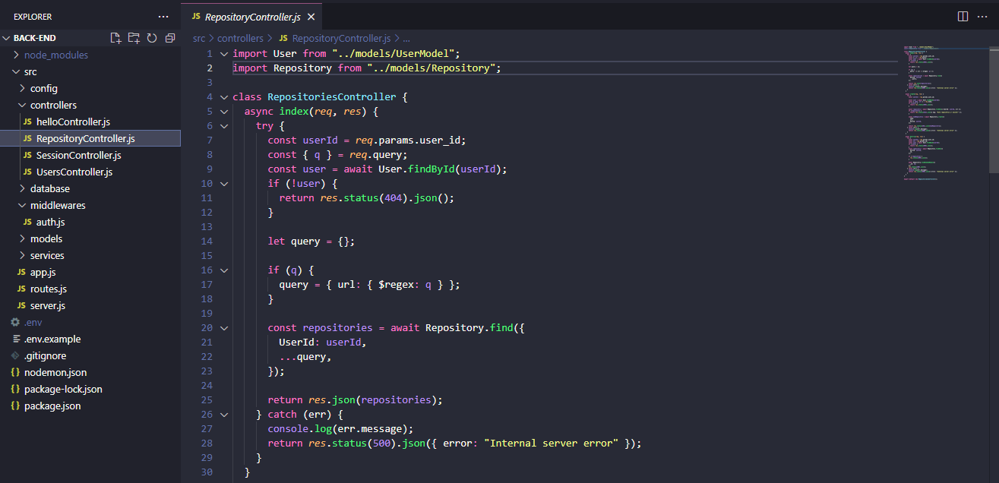
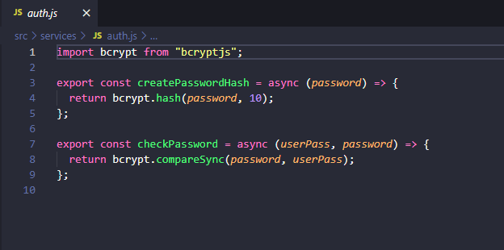

<h1 align="center">
    Dev-Repositórios (Full-Stack)
</h1>

<h1 align="center">Funcionalidades 🔧</h1>
<ul>
    <li>Aplicação que conta com sistema de login e autenticação JWT integrada com um banco de dados.
     O usuário que tem uma conta pré cadastrada no banco de dados, pode fazer o login, gerando um token, que expira depois de um tempo. Quando logado, o usuário pode inserir os links dos seus repositórios no GitHub, e a aplicação irá armazenar o nome e o dono do repositório no banco de dados(MongoDB). Vale lembrar que o sistema também conta uma criptografia não reversível de senhas, oferecendo mais segurança caso o banco seja invadido ou algo do tipo.</li>
</ul>  

<h2 align="center">
    Back-End
</h2>

## 🔧 Demonstração do Funcionamento

 Parte Central do Servidor 

 

 Integração das rotas e Controllers 

 

 Verificação do token, se não for válido, a aplicação não permite o acesso do usuário a página principal. 

 

 Criação do token, que é requisitada quando o usuário faz login no front-end 

 

 Controlador dos Repositórios, com os métodos de criação, deleção e listagem 

 

 Funções que fazem a criptografia e a comparação dos dados quando o usuário faz login.

