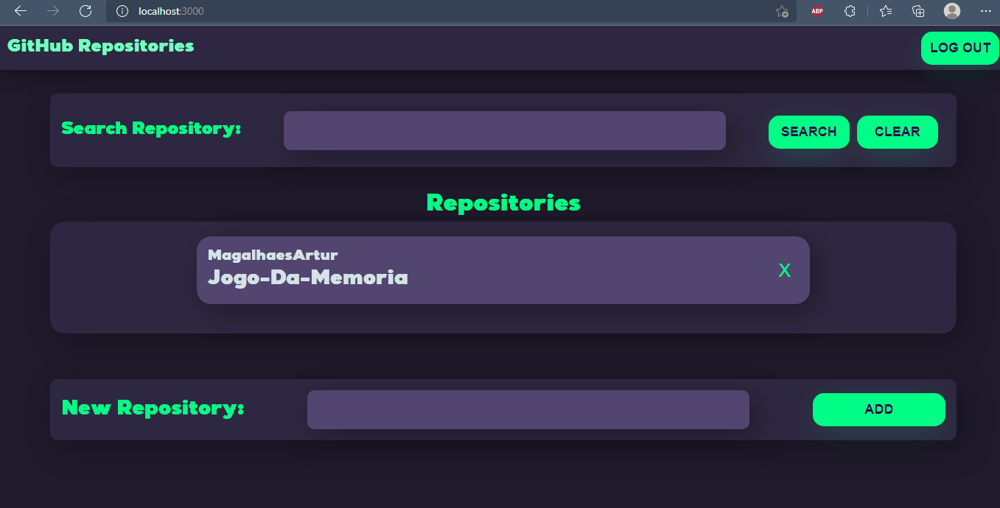

<h1 align="center">
    Dev-Repositórios (Full-Stack)
</h1>

<h1 align="center">Funcionalidades 🔧</h1>
<ul>
    <li>Aplicação que conta com sistema de login e autenticação JWT integrada com um banco de dados.
     O usuário que tem uma conta pré cadastrada no banco de dados, pode fazer o login, gerando um token, que expira depois de um tempo. Quando logado, o usuário pode inserir os links dos seus repositórios no GitHub, e a aplicação irá armazenar o nome e o dono do repositório no banco de dados(MongoDB). Vale lembrar que o sistema também conta uma criptografia não reversível de senhas, oferecendo mais segurança caso o banco seja invadido ou algo do tipo.</li>
</ul>  

## :rocket: Tecnologias

Esse projeto foi desenvolvido com as seguintes tecnologias:

✔️React

✔️React Router DOM

✔️Axios

✔️React Context

✔️Prettier

✔️React Hooks

✔️Node JS

✔️MongoDB

##

<h2 align="center">
    Back-End
</h2>

## 🔧 Demonstração do Funcionamento

 Parte Central do Servidor 

 

 Integração das rotas e Controllers 

 

 Verificação do token, se não for válido, a aplicação não permite o acesso do usuário a página principal. 

 

 Criação do token, que é requisitada quando o usuário faz login no front-end 

 

 Controlador dos Repositórios, com os métodos de criação, deleção e listagem 

 

 Funções que fazem a criptografia e a comparação dos dados quando o usuário faz login.

##

<h2 align="center">
    Front-End Feito em React
</h2>

 

Fazendo o login, lembrando que o usuário já está pré-cadastrado no banco de dados.

 

Acessando os repositórios do usuário, lembrando que cada usuário só pode ver os seus repositórios. Outros usuários não podem ver os repositórios que nao sejam seus.

 

Fazendo o Log Out, limpando o localstorage. Lembrando que o usuário só pode acessar a página principal se estiver logado e com um token válido, como podemos ver no gif.

##

<h1 align="center">O que aprendi 👨‍💻</h1>
<ul>
    <li>Melhor Entendimento do ReactJS no geral </li>
    <li>Uso efetivo de hooks</li>
    <li>Integração front-end/back-end na prática</li>
    <li>Axios para o consumo da API criada com NodeJS</li>
    <li>React Router DOM para o uso de rotas single-page </li>
    <li>Uso efetivo e prático do login jwt</li>
     <li>Uso efetivo e prático da criptografia de dados</li>
   
   
</ul>  

##

<h2>Estou aberto para dicas e conselhos na área de desenvolvimento web 😁</h2>

##

Made with 💜 by João Artur 👋 See my <a href="https://www.linkedin.com/in/magalhesartur/">Linkedin</a>

